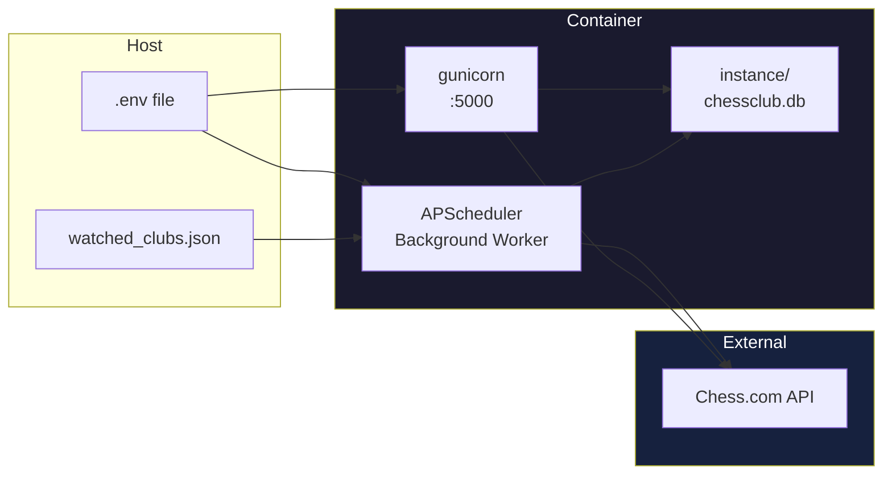
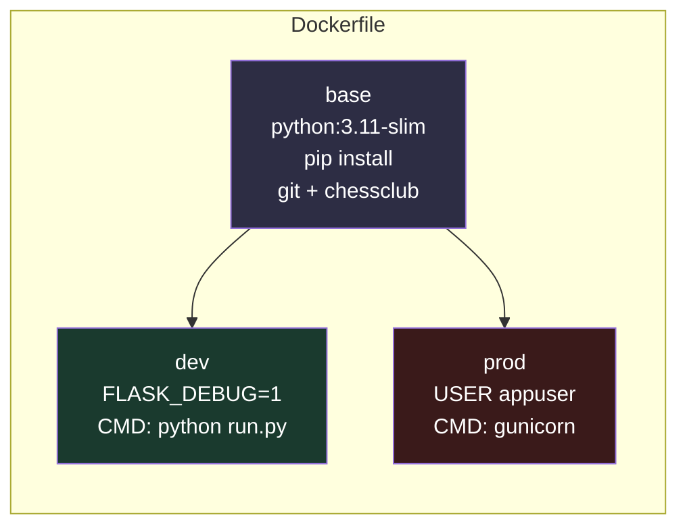

# Deployment

This document covers the deployment options for **chessclub-web**: Docker
multi-stage builds, native installation, production configuration, and
operational considerations.

---

## Table of Contents

- [Prerequisites](#prerequisites)
- [Docker Deployment](#docker-deployment)
- [Native Installation](#native-installation)
- [Production Configuration](#production-configuration)
- [Health Checks](#health-checks)
- [Backup and Recovery](#backup-and-recovery)
- [Troubleshooting](#troubleshooting)

---

## Prerequisites

| Resource | Requirement |
|----------|-------------|
| Python | 3.11+ |
| Disk | ~100 MB for the application + database |
| Chess.com credentials | Server cookies (`ACCESS_TOKEN` + `PHPSESSID`) for sync |
| (Optional) Docker | Docker Engine 24+ and Compose plugin |

---

## Docker Deployment

The project includes a Docker multi-stage build with three targets:

```dockerfile
# Stages defined in Dockerfile:
#   base   — Python 3.11-slim + dependencies + chessclub from GitHub
#   dev    — Flask dev server with hot reload (FLASK_DEBUG=1)
#   prod   — Gunicorn WSGI (4 threads, 1 worker)
```

### Container Architecture



### Development

```bash
docker compose up --build
```

Opens at `http://localhost:5000`. The Flask dev server auto-reloads on file
changes via volume mounts (implicit in the base Compose file).

### Production

```bash
docker compose -f docker-compose.yml -f docker-compose.prod.yml up -d --build
```

The production override:
- Builds the `prod` stage (gunicorn instead of Flask dev server).
- Sets `FLASK_DEBUG=0`.
- Enables `restart: unless-stopped`.

### Persistent Data

| Path | Container | Purpose |
|------|-----------|---------|
| `./instance/chessclub.db` | `/app/instance/chessclub.db` | SQLite database (volume: `db-data`) |
| `./watched_clubs.json` | `/app/watched_clubs.json` | Watched club slugs (bind mount) |

The `docker-compose.yml` defines a named volume `db-data` mapped to
`/app/instance`. The watched clubs file is bind-mounted to allow editing
without rebuilding.

### Multi-Stage Build Reference



---

## Native Installation

### System Dependencies

```bash
# Debian / Ubuntu
sudo apt update && sudo apt install -y python3.11 python3.11-venv git

# Fedora
sudo dnf install python3.11 python3.11-venv git

# macOS (Homebrew)
brew install python@3.11 git
```

### Application Setup

```bash
git clone https://github.com/cmellojr/chessclub-web.git
cd chessclub-web
python3.11 -m venv .venv
source .venv/bin/activate
pip install -r requirements.txt
cp .env.example .env
# Edit .env with your values
python run.py
```

### Production with Gunicorn

```bash
pip install gunicorn
gunicorn --bind 0.0.0.0:5000 --workers 1 --threads 4 "app:create_app()"
```

**Worker count guidance:** The sync worker runs in a background thread, not a
separate process. A single gunicorn worker with `--threads 4` is sufficient
for light concurrency. Increase workers only if request throughput becomes a
bottleneck — each worker creates its own APScheduler instance, so running
multiple workers will trigger duplicate sync jobs.

---

## Production Configuration

### Environment Variables

| Variable | Production Recommendation |
|----------|--------------------------|
| `SECRET_KEY` | Generate with `python -c "import secrets; print(secrets.token_hex(32))"`. **Never reuse the dev value.** |
| `ADMIN_PASSWORD` | Strong password (16+ characters). Rotate periodically. |
| `CHESSCOM_SERVER_ACCESS_TOKEN` | Expires ~24h. Automate refresh or monitor the admin dashboard. |
| `CHESSCOM_SERVER_PHPSESSID` | Expires ~14 days. Refresh alongside the access token. |
| `DATABASE_URI` | For production, use a persistent path outside the container. |
| `SYNC_INTERVAL_HOURS` | Keep at 6 or increase to 12. Frequent syncs increase API load. |
| `OAUTH_REDIRECT_URI` | Must match the registered Chess.com OAuth app URI exactly. |

### Reverse Proxy (Nginx)

```nginx
server {
    listen 80;
    server_name chessclub.example.com;

    location / {
        proxy_pass http://127.0.0.1:5000;
        proxy_set_header Host $host;
        proxy_set_header X-Real-IP $remote_addr;
        proxy_set_header X-Forwarded-For $proxy_add_x_forwarded_for;
        proxy_set_header X-Forwarded-Proto $scheme;
    }
}
```

### Environment Files

**Never commit `.env` to version control.** Use a secrets manager or
restricted-access file for production secrets. The `.dockerignore` excludes
`.env` from the Docker build context.

---

## Health Checks

The application has no built-in `/health` endpoint. For Docker health checks:

```yaml
# docker-compose.yml snippet
healthcheck:
  test: ["CMD", "python", "-c", "import urllib.request; urllib.request.urlopen('http://localhost:5000/')"]
  interval: 30s
  timeout: 10s
  retries: 3
  start_period: 10s
```

Monitor these signals externally:

| Signal | What It Indicates |
|--------|-------------------|
| Port 5000 responds with HTTP 200 | Application is running |
| `sync_status["last_run"]` is recent | Background sync is working |
| `sync_status["running"]` is `False` most of the time | No stuck sync threads |
| Chess.com admin dashboard loads | All routes compile correctly |

---

## Backup and Recovery

### What to Back Up

| Asset | Location | Frequency |
|-------|----------|-----------|
| SQLite database | `instance/chessclub.db` | Daily |
| Watched clubs list | `watched_clubs.json` | After changes |
| `.env` secrets | Secrets manager | Once (or on rotation) |

### Backup Script

```bash
#!/usr/bin/env bash
# backup.sh — run daily via cron
TIMESTAMP=$(date +%Y%m%d-%H%M)
cp instance/chessclub.db "backups/chessclub-${TIMESTAMP}.db"
cp watched_clubs.json "backups/watched_clubs-${TIMESTAMP}.json"
```

### Recovery

```bash
# 1. Stop the application
docker compose down

# 2. Restore the database
cp backups/chessclub-20260101-000000.db instance/chessclub.db

# 3. Restore the watched clubs list
cp backups/watched_clubs-20260101-000000.json watched_clubs.json

# 4. Restart
docker compose up -d
```

The application auto-creates tables on startup via `db.create_all()`.
Restoring the database file is sufficient — no migration commands needed.

---

## Troubleshooting

| Symptom | Likely Cause | Fix |
|---------|-------------|-----|
| 500 error on club pages | Chess.com cookies expired | Refresh `ACCESS_TOKEN` and `PHPSESSID` in `.env`, restart container. |
| Sync stuck on "running" | Background thread crashed or hit an unhandled exception | Restart the application. Check logs for traceback. |
| Admin login fails | `ADMIN_PASSWORD` is empty or incorrect | Verify `.env` contains `ADMIN_PASSWORD=`. |
| "No watched clubs" on dashboard | `watched_clubs.json` is missing or empty | Add clubs via the admin panel or write the JSON file manually. |
| Database locked error | Concurrent sync and route access on SQLite | SQLite handles this gracefully with retries. Persistent locks indicate a stuck sync thread — restart the application. |
| OAuth callback returns 404 | `OAUTH_REDIRECT_URI` does not match Chess.com app registration | Verify the URI exactly matches in both `.env` and the Chess.com developer console. |
| Container exits immediately | Missing `.env` or port conflict | Check `docker compose logs web` for the error. |
