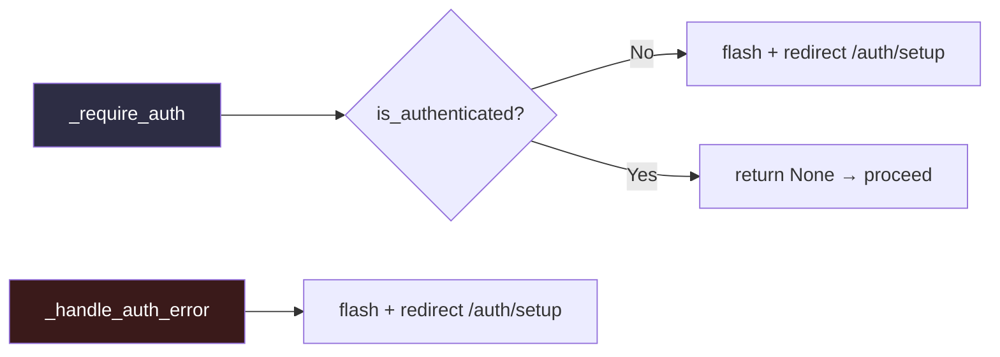
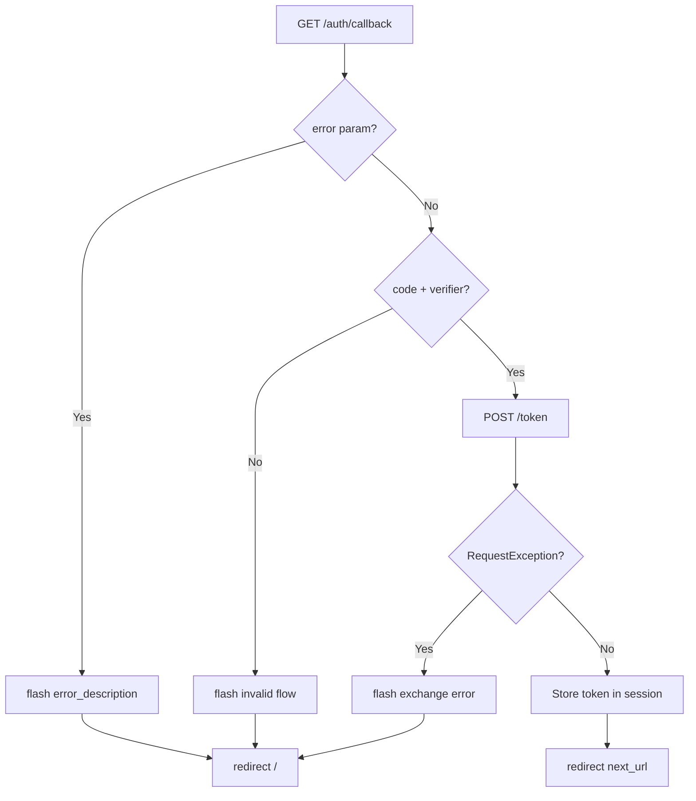
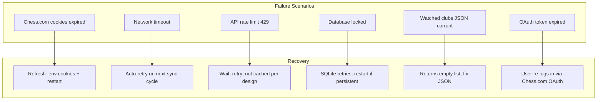

# Error Handling

This document describes the error-handling strategy used across
chessclub-web: how different layers catch, transform, and surface errors.

---

## Error Classification

Errors fall into four categories:

| Category | Source | Examples |
|----------|--------|----------|
| **Auth errors** | Chess.com API authentication failures | Expired cookies, missing credentials, 401/403 responses |
| **API errors** | Chess.com API request failures | Network timeouts, rate limits (429), server errors (5xx) |
| **Data errors** | Database or data integrity issues | Missing club, corrupt JSON, database locked |
| **Application errors** | Internal logic failures | Unexpected exceptions, programming errors |

---

## Error Flow Overview

```mermaid
flowchart TD
    subgraph Route Layer
        A[Route Handler] --> B{DB data exists?}
        B -- Yes --> C[Render template with DB data]
        B -- No --> D{Credentials valid?}
        D -- No --> E[_require_auth → flash + redirect]
        D -- Yes --> F[chessclub library call]
    end

    subgraph Service Layer
        F --> G{AuthenticationRequiredError?}
        G -- Yes --> H[_handle_auth_error → flash + redirect]
        G -- No --> I{ChessclubError / Exception?}
        I -- Yes --> J[flash(exc) + redirect]
        I -- No --> K[Render template with live data]
    end

    subgraph Sync Layer
        L[sync_club] --> M[Step 1..N]
        M --> N{Exception?}
        N -- Yes --> O[log + record in sync_status]
        N -- No --> P[sync_status = ok]
    end

    subgraph Template Layer
        C --> T[Rendered Page]
        K --> T
        T --> R{missing/None data?}
        R -- Yes --> S[Defaults or empty state]
        R -- No --> U[Render normally]
    end

    style Route Layer fill:#1a1a2e,color:#fff
    style Service Layer fill:#16213e,color:#fff
    style Sync Layer fill:#1a2a1e,color:#fff
    style Template Layer fill:#2a1a1e,color:#fff
```

---

## Layer-by-Layer Strategy

### 1. Route Layer

Routes follow a DB-first pattern. The error surface differs by path:

#### Watched Club Path (DB hit)

```python
club = db_service.get_club(slug)
if club:
    data = db_service.get_leaderboard(slug, ...)
    return render_template("...", data=data or [])
```

- If `get_club()` returns a club, all subsequent reads come from the DB.
- Read functions default to `None` on failure and routes coerce to
  `[]` or a sensible default in the template call.
- No error surface from the database layer reaches the user directly.

#### Library Fallback Path (DB miss)

```python
redir = _require_auth()           # Auth gate
if redir:
    return redir
try:
    client = chess_service.make_client(session)
    data = ChessService(client).get_leaderboard(slug, ...)
except AuthenticationRequiredError:
    return _handle_auth_error()    # Expired cookies
except Exception as exc:
    flash(str(exc), "danger")      # API failure
    return redirect(url_for("club.overview", slug=slug))
```

Three distinct error paths:

| Error | Handling |
|-------|----------|
| `AuthenticationRequiredError` | Friendly "credentials expired" flash + redirect to setup page. |
| `ChessclubError` (caught via `except Exception`) | Raw error message flashed (generic catch). |
| Any other `Exception` | Same fallthrough — flash + redirect. |

### 2. Auth Layer



`_require_auth` is called at the **top of the library-fallback path**,
before any network request. It prevents wasted API calls when credentials
are known to be missing.

`_handle_auth_error` is called when `AuthenticationRequiredError` is
**raised during** a library call — this means credentials existed at the
start of the request but were rejected by the server.

### 3. Sync Layer

The sync layer uses a **continuation strategy**: errors on one step do not
abort the entire sync cycle.

```python
for name, fn in steps:
    try:
        result = fn()
        status["steps"][name] = "ok"
        # persist...
    except Exception as exc:
        status["steps"][name] = str(exc)
        status["ok"] = False
        status["error"] = str(exc)
        log.warning("Sync failed %s/%s: %s", slug, name, exc)
```

**Behavior per error type:**

| Error Scenario | Impact |
|----------------|--------|
| Network timeout on `get_club()` | Club overview step marked as error. Other steps still execute. |
| Chess.com returns 500 on leaderboard | Leaderboard step fails. Club overview, members, tournaments may still succeed. |
| Database write fails | Step shows error but library cache is still warmed. |
| Invalid `watched_clubs.json` | `get_watched_clubs()` returns `[]`, sync is skipped. |

The sync error surface is exposed via `sync_status["clubs"][slug]["steps"]`,
visible on the admin dashboard.

### 4. OAuth Callback Layer



Three failure modes are explicitly handled:

| Failure | User Sees |
|---------|-----------|
| User denies authorization | Chess.com error description flashed. |
| User reloads `/callback` | "Invalid OAuth flow" (verifier already consumed). |
| Token exchange network failure | `RequestException` message flashed. |

### 5. Template Layer

Templates handle missing data defensively:

| Pattern | Example |
|---------|---------|
| Default empty list | `` |
| Default dash | `{{ club.description or "—" }}` |
| Conditional rendering | `` before table |
| Jinja2 filter fallback | `ts_to_date(None)` → `"—"` |

---

## Error Recovery Matrix



| Scenario | Detected | Impact | Recovery |
|----------|----------|--------|----------|
| Cookies expired | `AuthenticationRequiredError` in route or sync | Library fallback fails; sync fails | Update `.env` cookies |
| API down (5xx) | `Exception` in route | Library fallback fails; DB data still works | Wait for Chess.com recovery |
| Rate limit (429) | Not cached by library | Auto-retry on next request | Sync worker retries on next cycle |
| Network timeout | `Exception` in route | Brief outage for that request | Refresh or navigate again |
| DB file deleted | `get_club()` returns None | Fallback to library path | Re-sync from admin dashboard |
| Corrupt watched clubs JSON | `get_watched_clubs()` returns `[]` | Sync is skipped | Fix or recreate `watched_clubs.json` |
| OAuth token expired | `_SessionOAuthProvider.is_authenticated()` returns False | User sees login button | User clicks "Login Chess.com" |

---

## Error Handlers

Three custom error handlers are registered in the application factory:

| Handler | Route Matches | Behaviour |
|---------|---------------|-----------|
| `404`   | Any unmatched route | Renders `errors/404.html` with a user-friendly message. |
| `403`   | Forbidden access   | Renders `errors/403.html`. |
| `500`   | Internal errors    | Renders `errors/500.html` without leaking traceback or internals. |

## Health Endpoint

`GET /health` returns a JSON payload with application status and sync
information:

```json
{"status": "ok", "timestamp": "2026-06-10T12:00:00+00:00", "sync": {"last_run": null, "running": false}}
```

The endpoint requires no authentication and is suitable for load balancer
or Docker health checks.

## Known Gaps

| Gap | Risk | Mitigation |
|-----|------|------------|
| No input sanitization on club slug | Path traversal in rare edge cases | Slug is used in DB queries and URL construction, not filesystem. |
| Sync errors only visible on admin dashboard | User has no visibility into sync failures | Check admin dashboard periodically. |
