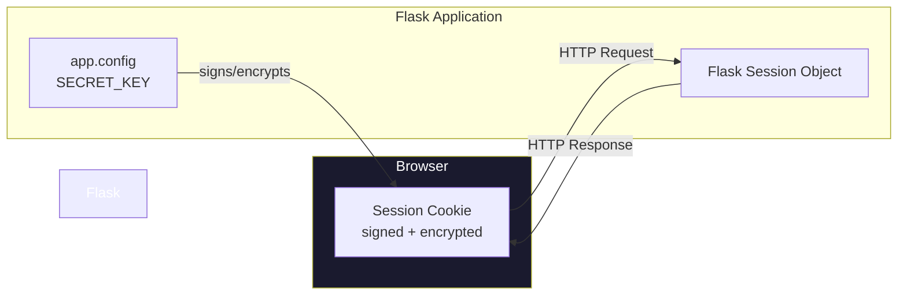
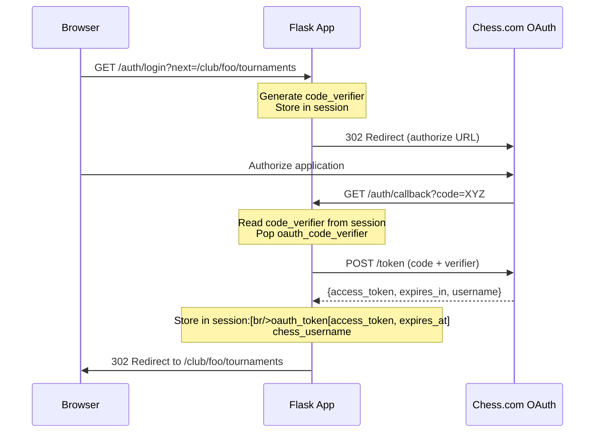
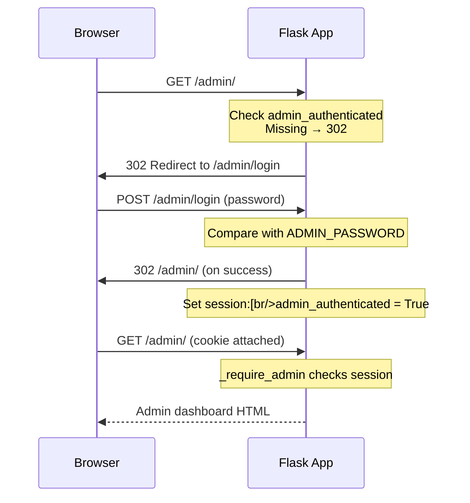
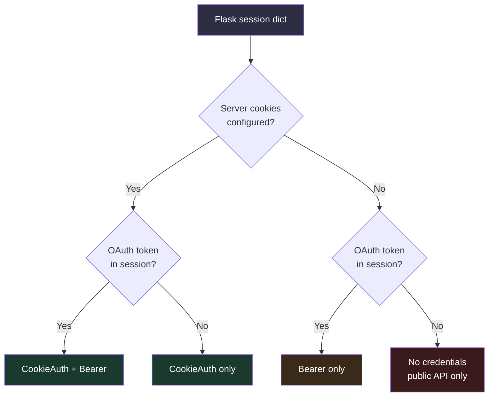
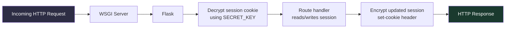

# Session Flow

This document describes how Flask sessions are used across chessclub-web
for authentication state, OAuth tokens, and admin access.

---

## Session Architecture



Flask uses a **client-side session** by default. Session data is serialized
to JSON, signed with `itsdangerous` using `SECRET_KEY`, and stored in a
signed cookie (`session`). The client never sees raw values — the cookie is
signed and optionally encrypted.

**Implications:**

- Session data is limited to ~4 KB (Cookie size limit).
- No server-side session store is required.
- Modifying `SECRET_KEY` invalidates all existing sessions.
- Session data persists across restarts (until the cookie expires).

---

## Session Keys

| Key | Type | Set By | Cleared By | Purpose |
|-----|------|--------|------------|---------|
| `oauth_code_verifier` | `str` | `auth.login()` | `auth.callback()` | PKCE code verifier for OAuth flow (one-time use). |
| `oauth_next` | `str` | `auth.login()` | `auth.callback()` | Redirect target after OAuth completes. |
| `oauth_token` | `dict` | `auth.callback()` | `auth.logout()` | OAuth 2.0 token: `{access_token, refresh_token, expires_at}`. |
| `chess_username` | `str` | `auth.callback()` | `auth.logout()` | Chess.com username from OAuth token response. |
| `admin_authenticated` | `bool` | `admin.login()` | `admin.logout()` | Admin panel session flag. |

---

## Auth Flow (OAuth 2.0 PKCE)



**Key detail:** The `oauth_code_verifier` is consumed on first use
(`session.pop()`). If the user reloads `/callback`, the verifier is gone
and the route returns an error flash. This prevents replay attacks.

### OAuth Token Lifetime

```python
# app/auth.py:119-126
session["oauth_token"] = {
    "access_token": token_data["access_token"],
    "refresh_token": token_data.get("refresh_token"),
    "expires_at": time.time() + token_data.get("expires_in", 3600),
}
```

The `_SessionOAuthProvider` in `chess_service.py` checks expiry with a
60-second safety buffer:

```python
# app/chess_service.py:38-41
def is_authenticated(self) -> bool:
    token = self._token_data
    expires_at = token.get("expires_at", 0)
    return bool(token.get("access_token")) and expires_at > time.time() + 60
```

---

## Admin Auth Flow



The `_require_admin` decorator in `admin.py` implements the gate:

```python
def _require_admin(f):
    @wraps(f)
    def decorated(*args, **kwargs):
        password = current_app.config.get("ADMIN_PASSWORD", "")
        if not password:                          # Admin disabled
            return redirect(url_for("club.index"))
        if not session.get("admin_authenticated"): # Not logged in
            return redirect(url_for("admin.login"))
        return f(*args, **kwargs)
    return decorated
```

---

## Credential Resolution

`chess_service.make_client(session)` resolves credentials in priority order:



---

## Session Expiry and Security

| Key | Lifespan | Notes |
|-----|----------|-------|
| Flask session cookie | Configurable (`PERMANENT_SESSION_LIFETIME`, default 31 days) | Uses `SESSION_COOKIE_HTTPONLY` and `SESSION_COOKIE_SAMESITE` defaults. |
| `oauth_token` | Depends on Chess.com's `expires_in` (typically 1 hour) | No refresh token flow implemented — user re-logs in when expired. |
| `admin_authenticated` | 30 minutes of inactivity (configurable via `ADMIN_SESSION_TIMEOUT_MINUTES`) | Cleared automatically on timeout; log out explicitly via `/admin/logout`. |
| `chess_username` | Same as `oauth_token` | Cleared on logout alongside the token. |

**Security notes:**

- OAuth tokens are stored in the signed cookie, never on the server
  filesystem.
- The admin check relies on the session flag plus CSRF token validation
  on all admin POST routes via the `_csrf_required` decorator.
- The `oauth_code_verifier` is a single-use 64-byte URL-safe token
  (`secrets.token_urlsafe(64)`).
- Server cookie credentials (`ACCESS_TOKEN`, `PHPSESSID`) are never
  written to the session — they remain in server-side config only.

---

## Session Lifecycle Per Request



The session object behaves as a standard Python dictionary within a request.
All modifications are collected and serialized at the end of the request.
The `SessionMixin` in Werkzeug handles the `session.sid` (if used) and
cookie management automatically.
