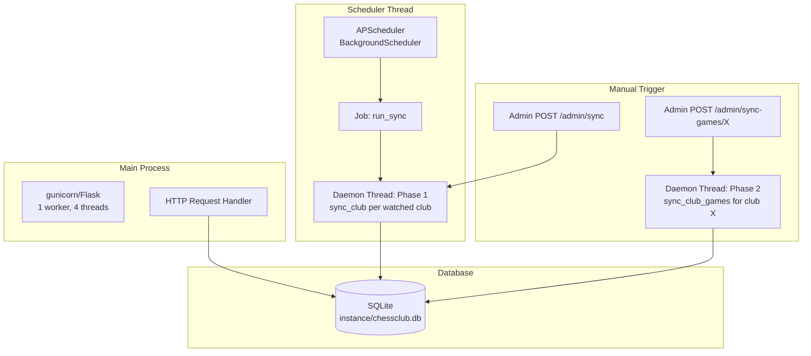
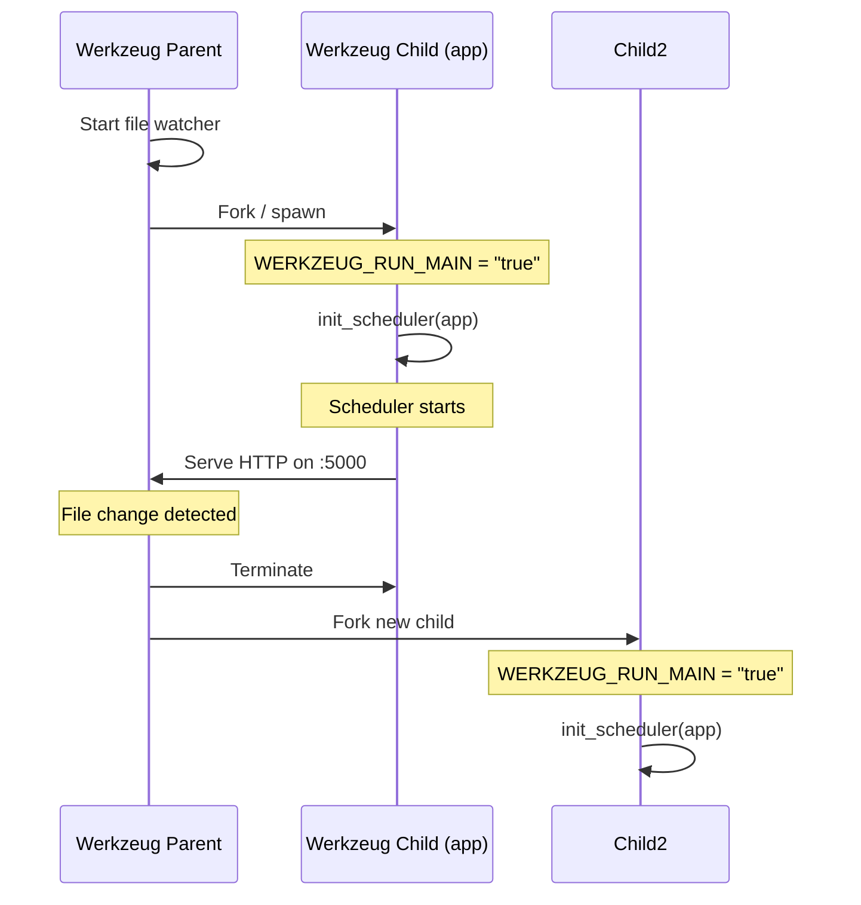
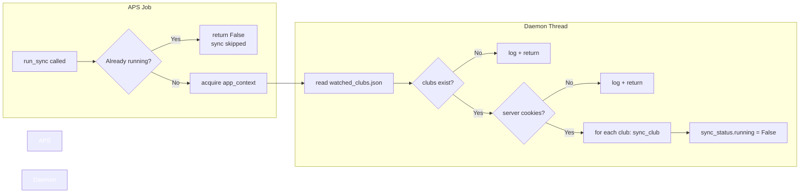
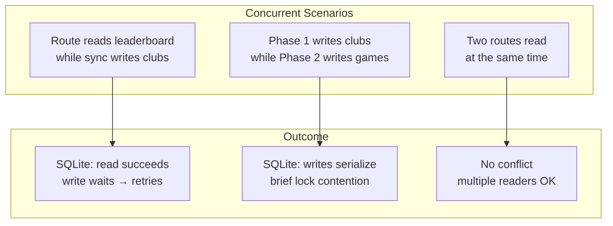

# Threading Model

This document describes the concurrency architecture of chessclub-web:
how background sync workers are scheduled, how threads are managed, and
how concurrent database access works.

---

## Overview

The application runs two concurrent workloads:

| Workload | Scheduler | Scope | Trigger |
|----------|-----------|-------|---------|
| **Flask request handling** | WSGI server (single process) | Per-request | HTTP requests |
| **Background sync (Phase 1)** | APScheduler `BackgroundScheduler` | All watched clubs | Timer (default: 6h) + manual |
| **Background sync (Phase 2)** | `threading.Thread` | One club | Manual (admin dashboard) |



---

## Thread Initialization

### Application Startup

```python
# app/__init__.py
def create_app() -> Flask:
    app = Flask(__name__)
    # ... config, db init, blueprints ...

    if not app.debug or os.environ.get("WERKZEUG_RUN_MAIN") == "true":
        from app.sync import init_scheduler
        init_scheduler(app)

    return app
```

**Reloader guard:** In debug mode, Flask's reloader starts a child process
for the application and a parent process that watches for file changes.
Without the `WERKZEUG_RUN_MAIN` guard, two scheduler instances would run
simultaneously — one in each process.



### Scheduler Initialization

```python
# app/sync.py
_scheduler: BackgroundScheduler | None = None

def init_scheduler(app: Flask) -> None:
    global _scheduler
    if _scheduler is not None:
        return                               # Singleton guard

    interval = app.config.get("SYNC_INTERVAL_HOURS", 6)
    _scheduler = BackgroundScheduler(daemon=True)
    _scheduler.add_job(
        run_sync,
        "interval",
        hours=interval,
        args=[app],
        id="club_sync",
        next_run_time=datetime.now(UTC),     # Run immediately on startup
    )
    _scheduler.start()
```

**Singleton guard:** The global `_scheduler` flag prevents double
initialization if `init_scheduler` is somehow called twice.

**`daemon=True`:** The scheduler thread is a daemon thread. When the main
process exits, the scheduler is terminated immediately — no graceful
shutdown.

**`next_run_time=now`:** The first sync job fires immediately at startup,
then every `SYNC_INTERVAL_HOURS` thereafter.

---

## Background Sync Threads

### Phase 1: Light Data Sync

```python
def trigger_sync_async(app: Flask) -> bool:
    if sync_status["running"]:
        return False                        # Gate: one at a time
    thread = threading.Thread(
        target=run_sync, args=[app], daemon=True
    )
    thread.start()
    return True
```

```python
def run_sync(app: Flask) -> None:
    with app.app_context():
        # read watched clubs
        # iterate clubs → sync_club(slug, client)
        sync_status["running"] = False
```



### Phase 2: Game Archive Sync

```python
def trigger_game_sync_async(app: Flask, slug: str) -> bool:
    club_status = sync_status["clubs"].get(slug, {})
    game_sync = club_status.get("game_sync", {})
    if game_sync.get("running"):
        return False                        # Gate: one per club
    thread = threading.Thread(
        target=_run_game_sync, args=[app, slug], daemon=True
    )
    thread.start()
    return True
```

The gate is **per club**: each club can have its own game sync thread
running simultaneously. Phase 1 and Phase 2 can also run concurrently for
different clubs.

```mermaid
flowchart LR
    subgraph Available Threads
        P1[Phase 1: club_alpha]
        P2[Phase 2: club_alpha<br/>games]
        P3[Phase 2: club_beta<br/>games]
    end

    subgraph Gates
        G1[sync_status.running]
        G2[sync_status.clubs[alpha].game_sync.running]
        G3[sync_status.clubs[beta].game_sync.running]
    end

    P1 --> G1
    P2 --> G2
    P3 --> G3
```

---

## Concurrency and SQLite

SQLite has limited concurrency. Writes lock the entire database file.

### Access Patterns

| Operation | Type | Lock Held |
|-----------|------|-----------|
| `db_service.get_*()` | Read | Shared (read) |
| `db_service.upsert_*()` | Write | Exclusive (write) |
| `db_service.delete + insert` | Write (transaction) | Exclusive |

### Conflict Matrix



SQLite uses reader-writer locks:
- Multiple concurrent readers are allowed.
- A write request blocks all readers until the write transaction completes.
- SQLite retries automatically on `database is locked` errors (default
  timeout: 5 seconds in Flask-SQLAlchemy).

---

## Thread Safety Considerations

### Shared Mutable State

| Variable | Type | Accessed By | Thread-Safe? |
|----------|------|-------------|--------------|
| `sync_status` | `dict` | Routes (read), sync threads (write) | **Yes** — protected by `_sync_lock` (`threading.Lock`). Reads acquire a lock and return a shallow copy; writes always acquire the lock. |
| `_scheduler` | `BackgroundScheduler` | Scheduler thread only | Yes — only the scheduler thread accesses it after init. |
| SQLAlchemy session | `scoped_session` | Per-request + per-thread | Yes — Flask-SQLAlchemy uses thread-local scoped sessions. Each thread gets its own session. |
| `watched_clubs.json` | File | Admin routes (write), sync (read) | **Yes** — writes use `portalocker.Lock` for cross-platform file locking with a 5-second timeout. Reads (JSON parse) are not locked, but write-write races are prevented. |

### Flask App Context

All sync threads must acquire an application context before touching the
database:

```python
def run_sync(app: Flask) -> None:
    with app.app_context():   # Required for SQLAlchemy
        # ... database operations ...

def _run_game_sync(app: Flask, slug: str) -> None:
    with app.app_context():   # Required for SQLAlchemy
        sync_club_games(slug, client)
```

Without `app.app_context()`, SQLAlchemy calls fail with
"Working outside of application context."

---

## Failure Modes

| Scenario | Symptom | Recovery |
|----------|---------|----------|
| Sync thread crashes | `sync_status["running"]` stays `True` | Restart the application. The daemon thread terminates with the process. |
| Two sync triggers race | Second call returns `False` ("already running") | Wait for the running sync to complete. |
| Scheduler fires while manual sync runs | Second `run_sync` returns immediately (gate active) | Manual sync runs to completion. Scheduled run is skipped. |
| Database locked during sync | SQLite retries (default timeout). If persistent, the sync step fails. | Reduce concurrent writes or increase SQLite timeout via `SQLALCHEMY_ENGINE_OPTIONS`. |
| Process killed | Daemon threads terminate immediately | Partial sync state may be left in `sync_status`. On restart, scheduler runs a full sync. |

---

## Configuration

| Variable | Default | Effect |
|----------|---------|--------|
| `SYNC_INTERVAL_HOURS` | 6 | APScheduler interval for Phase 1. |
| `SQLALCHEMY_ENGINE_OPTIONS` | (not set) | Pass SQLAlchemy engine options (e.g., `{"pool_pre_ping": True, "connect_args": {"timeout": 10}}`). |
